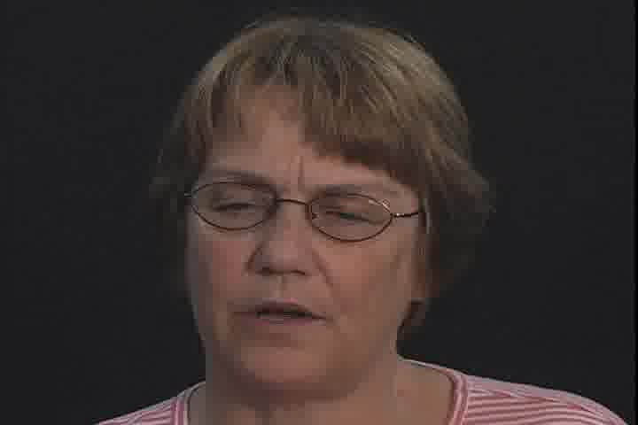

# Lip_reading
Use ffmpeg to extract every frame from 924 videos, detect and crop the mouth area using OpenCV.

Use CNN and statistical modeling techniques to develop algorithms on Linux to recognize people’s viseme, predict what people say.

Comprehensive analysis lip reading results and speech recognition results to decide the final predict sentences. 

This is a lip reading project. Using Convolutional Neural Network to train the model. This model can recognize the viseme of mouth in videos. 

Use instruction:
1. Put your vedio files in the 'mov' folder.
2. Edit your input_path to the path you save the code.
3. Edit your result path(By defult is in result folder).

Notice: The accrucy is only 55%. You may need to get final results combining with audio model's results.

The pictures extract from vedios look like this:

Then use OpenCV to crop the mouth area:

We need to convert the picture to black and white:

The pixel values fall in the range of 0 to 255, we need to scale them to 0 to 1, the picture matrix example shows below:

array([[ 0.34509804,  0.34901961,  0.34901961, ...,  0.3254902 ,
         0.32941176,  0.33333333],
       [ 0.28627451,  0.29019608,  0.29803922, ...,  0.32156863,
         0.32941176,  0.32941176],
       [ 0.29803922,  0.29411765,  0.30196078, ...,  0.32156863,
         0.3254902 ,  0.3254902 ],
       ..., 
       [ 0.30588235,  0.30196078,  0.29803922, ...,  0.3254902 ,
         0.32941176,  0.32941176],
       [ 0.29803922,  0.29803922,  0.29803922, ...,  0.32156863,
         0.32156863,  0.32156863],
       [ 0.30980392,  0.31764706,  0.3254902 , ...,  0.3254902 ,
         0.3254902 ,  0.3254902 ]])

Then we can use the data to train our CNN model.
